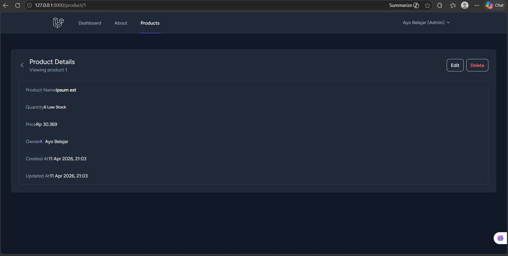

# Dokumentasi Pertemuan 7 - Laravel Components

Pada pertemuan 7 ini, fokus utama adalah implementasi **Blade Components** di Laravel. Component memungkinkan kita untuk membuat potongan UI yang dapat digunakan kembali (reusable), sehingga kode pada view menjadi lebih bersih dan modular.

Berikut adalah rincian implementasi yang telah dilakukan:

---

## 1. Implementasi Component `AddProduct`

Component ini dibuat untuk menangani tombol "Add Product" secara dinamis.

- **Logic Component (`AddProduct.php`)**: Menerima parameter `url` dan `name` melalui constructor.
- **View Component (`add-product.blade.php`)**: Menampilkan tombol dengan link dan teks yang sesuai dengan data yang dikirimkan.

---

## 2. Implementasi Component `EditProduct` & `DeleteProduct`

Sebagai bagian dari penugasan, dibuat juga component untuk aksi **Edit** dan **Delete** pada daftar produk.

- **EditProduct**: Digunakan untuk menampilkan tombol edit yang mengarah ke form perubahan data produk.
- **DeleteProduct**: Digunakan untuk menangani aksi penghapusan produk dengan modal konfirmasi atau form delete yang aman.

---

## 3. Hasil Implementasi pada View

Seluruh component tersebut telah diintegrasikan ke dalam halaman index produk (`product/index.blade.php`). Berikut adalah tampilan tombol Detail, Edit, dan Delete yang telah menggunakan component:

---

## Kesimpulan

Dengan menggunakan Blade Components, struktur kode pada halaman index menjadi lebih rapi. Kita tidak perlu menuliskan elemen HTML tombol secara berulang, melainkan cukup memanggil tag component seperti `<x-add-product />`, `<x-edit-product />`, dan `<x-delete-product />`. Hal ini sangat membantu dalam pemeliharaan kode (maintenance) di masa mendatang.
